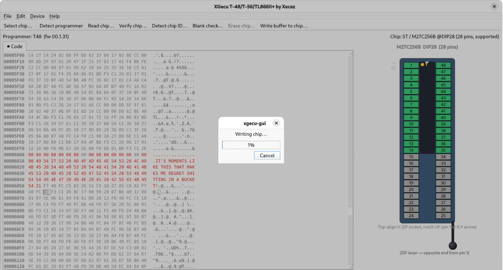

# Using xgecu-gui

A guided tour of the GUI. Assumes the app is installed (`.deb` or `cmake --install`) or run from a build directory.



## Contents

- [First-time setup](#first-time-setup)
- [The main window at a glance](#the-main-window-at-a-glance)
- [Reading a chip](#reading-a-chip)
- [Detect chip ID — sanity-check the selection](#detect-chip-id--sanity-check-the-selection)
- [Saving and loading buffers](#saving-and-loading-buffers)
- [Editing the buffer](#editing-the-buffer)
- [Erasing a chip](#erasing-a-chip)
- [Writing a chip](#writing-a-chip)
- [Code vs Data (EEPROM) tabs](#code-vs-data-eeprom-tabs)
- [Troubleshooting](#troubleshooting)

---

## First-time setup

### USB permissions

The T48 / T56 / TL866II+ live on USB as `a466:0a53`. Out of the box, only `root` can talk to them. The `.deb` install drops the right udev rules in `/usr/lib/udev/rules.d/`; if you're running from a build tree, install them by hand once:

```bash
sudo cp third_party/minipro/udev/60-minipro.rules /etc/udev/rules.d/
sudo cp third_party/minipro/udev/61-minipro-uaccess.rules /etc/udev/rules.d/
sudo udevadm control --reload
sudo udevadm trigger
```

Unplug and replug the programmer. Confirm with `ls -l /dev/bus/usb/<bus>/<dev>` — it should carry an ACL granting your user `rw`.

### GNOME title-bar tip

GNOME hides the minimize and maximize buttons by default. If you want them next to the X (system-wide for every Qt/GTK app):

```bash
gsettings set org.gnome.desktop.wm.preferences button-layout 'appmenu:minimize,maximize,close'
```

`Ctrl+M` toggles maximize from inside the app regardless of WM config.

---

## The main window at a glance

| Region | What you'll find |
| --- | --- |
| **Top banner** | Programmer model + firmware on the left, currently-selected chip on the right. Both update live. |
| **Toolbar** | Device actions: Select chip, Detect programmer, Read, Verify, Detect chip ID, Blank check, Erase, Write. |
| **Tabs** | One per memory area — **Code** is always present; **Data (EEPROM)** appears when the bound chip has separate EEPROM. A leading `●` on a tab means that buffer has unsaved edits. |
| **Hex view** | Editable. Click to position, drag or Shift+arrow to select, type to overwrite. Edited bytes turn red until you save the buffer to disk or write it to the chip. |
| **Right panel** | ZIF-socket preview: which pins the chip occupies, where pin 1 sits, where the lever is. |
| **Status bar** | Operation results, chip-binding details, find/search messages. |

Key shortcuts:

| Shortcut | Action |
| --- | --- |
| `Ctrl+L` | Select chip… |
| `Ctrl+R` | Read chip… |
| `Ctrl+Y` | Verify chip… |
| `Ctrl+I` | Detect chip ID… |
| `Ctrl+B` | Blank check… |
| `Ctrl+E` | Erase chip… |
| `Ctrl+W` | Write buffer to chip… |
| `Ctrl+F` | Find bytes… |
| `F3` | Find next |
| `Ctrl+G` | Go to offset… |
| `Ctrl+Z` / `Ctrl+Y` | Undo / Redo (hex edits) |
| `Ctrl+M` | Toggle maximize |

---

## Reading a chip

1. Plug in the programmer. The banner should say `Programmer: T48` (or T56 / TL866II+) with a firmware version. If it says **detecting…** for more than a couple of seconds, see [Troubleshooting](#troubleshooting).
2. Insert the chip — the ZIF preview tells you exactly how:
   - **Top-justify** the chip in the socket (closest to the IC↑ arrow on the case, opposite end from the lever).
   - **Notch faces UP**, away from the lever.
   - Pin 1 lines up with the yellow dot on the diagram.
3. Click **Device → Select chip…** (Ctrl+L). The dialog shows ~32,000 supported chips plus ~5,000 grayed-out Windows-only entries (those you'd need Xgpro for). Use the search box. Pick the right manufacturer — many parts have signature differences between e.g. Atmel and Microchip-rebranded fabs.
4. Click **Device → Read chip…** (Ctrl+R). A progress dialog appears with a Cancel button (block-boundary cooperative). When it finishes, the hex view fills with the chip's contents.
5. Status bar reports `Read <N> bytes from code memory`.

---

## Detect chip ID — sanity-check the selection

If the chip family supports it (most AVRs, PICs, SPI flash), **Device → Detect chip ID…** (Ctrl+I) reads the silicon signature and compares it to what the selected database entry expects:

- **Match** — green light, you're set.
- **Mismatch** — the dialog tells you what the silicon *actually* says and which database entry that corresponds to. Common case: you picked the wrong manufacturer-prefixed variant. Re-select using the suggested name and try again.
- **No protocol** — UV-EPROMs (27Cxx, 27LV…), most 24Cxx I²C EEPROMs, 93Cxx microwire EEPROMs and similar have no readable signature. The dialog says so. You're responsible for the selection in these cases.

It's a good idea to run Detect chip ID whenever you bind a new chip, before any destructive op.

---

## Saving and loading buffers

- **File → Open buffer…** loads a raw binary file into the active tab. Drag-and-drop a file onto the window does the same thing.
- **File → Save buffer…** writes the active buffer to disk and clears the red "dirty" coloring.

The "code" and "data" tabs save to separate files — they're independent buffers.

---

## Editing the buffer

The hex view is fully editable.

- Click a byte to position the cursor.
- Type hex digits in the Hex column; the high nibble commits first (shown with a stripe), the low nibble finishes the byte and advances.
- `Tab` flips the cursor between Hex and ASCII columns. In ASCII you type the byte directly.
- Drag with the mouse, or hold Shift while pressing arrow / Page / Home / End to select a range. `Ctrl+A` selects everything.
- Edited bytes go red until you save the file or write the buffer to the chip.
- `Ctrl+Z` / `Ctrl+Y` undo/redo, with a per-tab stack.

### Edit menu power tools

- **Fill…** — operate on the current selection (or the whole buffer if nothing is selected). Specify start, end, and a hex pattern of any length. A four-byte pattern like `EA F1 00 2C` will tile across the range. One undo step.
- **Copy range…** — copy `[src_start, src_end]` into a destination offset. Source bytes are snapshotted up-front, so overlapping ranges (e.g. copy `0x0..0xFF` into `0x80`) work correctly. One undo step.
- **Find bytes…** (Ctrl+F) — pattern in **Hex**, **ASCII text**, or **Decimal bytes**. Picker shows live preview of the bytes being searched. `F3` finds next, wraps around, and tells you when there are no more matches after the cursor.
- **Go to offset…** (Ctrl+G) — decimal or `0x…` hex.

---

## Erasing a chip

**Device → Erase chip…** (Ctrl+E). Some constraints:

- The action is disabled when the bound chip is not electrically erasable. UV-EPROMs (27Cxx), OTP parts, and mask ROMs all fall in this category — they need a UV lamp, or simply can't be erased.
- The dialog is destructive-styled and *Cancel is the default* button.
- **Pre-erase safety probe**: the worker reads the first block of code memory first. If it reads as all `0xFF`, that either means the chip is already blank or **no chip is in the socket** — the T48 cannot electrically tell those apart. The erase is refused with a dialog. If you're sure the chip is seated, tick the **Force** checkbox.
- After a successful erase, the app offers to run **Blank check** immediately as a sanity check.

---

## Writing a chip

**Device → Write buffer to chip…** (Ctrl+W). Active tab determines what gets written (Code or Data).

Requirements:

- A chip is bound and the buffer for the active tab is **exactly the chip's** code-memory (or data-memory) size. Open a matching-size file, or Read first to set the buffer up.
- Most EEPROM/flash chips also need an **Erase** first, unless the chip you're targeting is already blank or only differs from the existing contents by bits you can program (`1 → 0`).

The dialog shows the chip name, the buffer size, and offers:

- **Auto-verify after write** (default on) — re-reads the chip in the same transaction and byte-compares against the source buffer. Result is reported as `Wrote N bytes — auto-verify OK` or with the precise mismatch counts.
- **Write** vs **Write (force)** — the latter skips the pre-write blank-probe. The probe refuses if the chip's first block reads all `0xFF` AND the buffer is not itself all `0xFF` (so writing 0xFF over a possibly-empty socket isn't blocked unnecessarily).

Cancel mid-write is cooperative on block boundaries. A cancelled write leaves the chip in a partially-written state — re-erase before retrying.

---

## Code vs Data (EEPROM) tabs

Some chips have separate **code** memory (Flash or EPROM) and **data** memory (EEPROM). Examples:

| Chip | Code | Data |
| --- | --- | --- |
| ATmega328P | 32 KB Flash | 1 KB EEPROM |
| ATtiny85 | 8 KB Flash | 512 B EEPROM |
| PIC16F628A | 3.5 KB Flash | 128 B EEPROM |

When you bind such a chip the **Data (EEPROM)** tab appears. Each tab:

- Has its own buffer, hex view, dirty state, and undo stack.
- Read / Verify / Write act on the **active tab's** memory area.
- File Open / Save read or write the active tab.
- Erase is always a whole-chip operation (it clears both Code and Data).
- Blank check operates on the active area.

Chips without a separate EEPROM area (UV-EPROMs, NOR flash, etc.) only get the Code tab.

---

## Troubleshooting

### `Programmer: not detected`

- The udev rules aren't installed or `udevadm` wasn't reloaded after install. See [First-time setup](#first-time-setup).
- The cable is bad, the device is in bootloader mode, or another app holds the USB interface. Close any other minipro/Xgpro instances.

### Detect chip ID says "Mismatch" with a different name

The silicon really is a different part than the database entry you picked. Re-select using the name the dialog suggested. This is *common* with re-branded silicon — e.g. a chip silk-screened "Microchip 27C256" is electrically identical to the Atmel `AT27C256` (chip-id `0x298C`), distinct from the Intel `27C256` (`0x898C`).

### Erase / Write refuse with "first block reads as all 0xFF"

The T48 has no hardware "is a chip in the socket" detection. Our software-level probe protects you: an empty socket reads as all `0xFF`, and so does an already-blank chip. If you're sure the chip is seated, tick **Force** in the dialog and retry.

### Read returns garbage

- Chip is misaligned. Check the ZIF preview: pin 1 of the chip should be at the top-left, notch facing up.
- Wrong chip variant selected — Detect chip ID will catch this for chips with signatures.
- Bent / dirty pins; reseat the chip a few times.

### Verify fails after a fresh Read → Save → Write on a UV-EPROM

UV-EPROM cells can only be programmed `1 → 0`, never `0 → 1`. Once a bit is `0` it stays `0` until you UV-erase the chip. If you wrote a `1`-bit on top of an already-programmed `0`-bit, the cell can't accept it and verify fails for that byte. Fix: UV-erase the chip and try again.

### Maximize via title bar double-click goes vertical-only on GNOME

GNOME's compositor handles the double-click. The default `action-double-click-titlebar` is `toggle-maximize` (full maximize) — if it's behaving differently, check:

```bash
gsettings get org.gnome.desktop.wm.preferences action-double-click-titlebar
```

`Ctrl+M` works regardless.

### `gsettings` adds the buttons but they don't appear

The Qt app needs a restart after the layout change for the WM to redraw the decorations. Close and reopen `xgecu-gui`.

---

## Where to file issues

GitHub: <https://github.com/xecaz/xgecu-t48.debian.gui>. Please include:

- Distro + version (`lsb_release -a`).
- Output of `lsusb | grep a466`.
- Output of `./build/xgecu-gui` from a terminal (stderr captures useful warnings).
- Exact chip family + package and what action triggered the bug.
